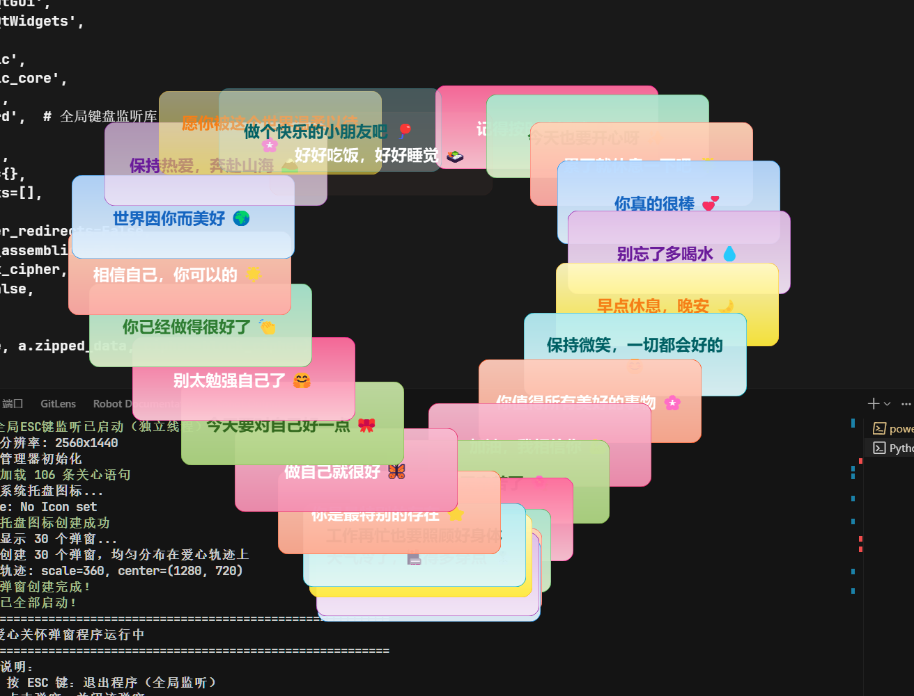

# 爱心关怀弹窗 💖

让弹窗沿着爱心轨迹运动，向你传递温暖和关怀。

## 📸 效果演示



> 30个弹窗沿着爱心轨迹分布，每个显示不同的关心语句 ❤️

## ✨ 特性

- ❤️ **完整的爱心轨迹** - 弹窗均匀分布，清晰展示心形
- 🎨 **多彩渐变色** - 10种内置配色主题
- 💬 **100+条关心语句** - 可自定义
- 🎬 **流畅动画** - 淡入淡出、脉动效果
- ⌨️ **全局ESC退出** - 任意时刻按ESC键退出（独立线程监听）
- 📦 **一键打包** - 可生成独立EXE

## 🚀 快速开始

### 1. 安装依赖
```bash
pip install -r requirements.txt
```

**重要：** 需要以**管理员权限**运行

### 2. 运行程序
```bash
cd src
python main.py
```

### 3. 使用说明
- **按 ESC 键** - 退出程序（全局监听，任意时刻有效）
- **点击弹窗** - 关闭单个弹窗
- **双击托盘** - 重新显示弹窗

## 📦 打包成EXE

### 方法1：使用当前环境（默认）
```bash
build.bat
```

### 方法2：指定Python环境
```bash
# 使用系统Python
build.bat python

# 使用指定Python路径
build.bat C:\Python310\python.exe

# 使用虚拟环境
build.bat venv\Scripts\python.exe

# 使用Conda环境
build.bat C:\anaconda3\envs\myenv\python.exe
```

### 打包参数说明

| 命令               | 说明                     |
| ------------------ | ------------------------ |
| `build.bat`        | 使用当前激活的Python环境 |
| `build.bat python` | 使用系统默认Python       |
| `build.bat <路径>` | 使用指定路径的Python     |

### 打包后文件

打包完成后，在 `dist` 文件夹中找到 `HeartCarePopups.exe`

**完整分发包结构**：
```
HeartCarePopups/
├── HeartCarePopups.exe
├── config.json
└── data/
    └── messages.txt
```

**注意**：打包后的EXE需要以管理员权限运行才能使用ESC键功能。

## ⚙️ 配置

编辑 `config.json` 文件：

```json
{
  "num_popups": 30,              // 弹窗数量（建议15-30）
  "messages_file": "messages.txt" // 消息文件名
}
```

### 弹窗数量建议
- **15-20个**: 疏密适中，每个弹窗都清晰可见
- **20-30个**: 完整展示爱心轨迹，推荐！ ⭐
- **30-50个**: 密集展示，适合大屏幕

### 自定义关心语句

编辑 `data/messages.txt`，每行一条（支持emoji）：
```
记得按时吃饭哦 💖
今天也要开心呀 ✨
累了就休息一下吧 🌟
你真的很棒 💕
别忘了多喝水 💧
```

## 🎨 技术实现

### ESC键全局监听架构

```
主进程 (Qt GUI)                监听线程 (独立)
┌──────────────────┐         ┌─────────────────┐
│  HeartCareApp    │         │ keyboard.hook   │
│  [弹窗管理]      │◄─signal─│  [ESC按下]      │
│  [托盘图标]      │         │  全局监听       │
│  quit_app()      │         │  系统级钩子     │
└──────────────────┘         └─────────────────┘
```

### 爱心轨迹公式
```
x(t) = 16·sin³(t)
y(t) = 13·cos(t) - 5·cos(2t) - 2·cos(3t) - cos(4t)
```

其中 t ∈ [0, 2π]，通过参数方程生成标准心形曲线。

### 技术栈
- **PyQt5** - GUI框架
- **NumPy** - 数学计算
- **Pydantic** - 配置管理
- **Loguru** - 日志系统
- **keyboard** - 全局键盘监听（系统级钩子）

## 📁 项目结构

```
heartcare-popups/
├── src/
│   ├── main.py            # 主程序（全局ESC监听）
│   ├── heart_window.py    # 弹窗组件
│   ├── heart_trajectory.py # 轨迹计算
│   └── config.py          # 配置管理
├── data/
│   └── messages.txt       # 关心语句（100+条）
├── config.json            # 配置文件
├── requirements.txt       # 依赖列表
├── build.bat             # 打包脚本（支持指定Python环境）
├── demo.png              # 演示截图
└── README.md             # 项目说明
```

## 🐛 常见问题

### 打包相关

**Q: 如何指定Python环境打包？**  
A: 
```bash
# 方法1：直接指定路径
build.bat C:\Python310\python.exe

# 方法2：使用虚拟环境
build.bat venv\Scripts\python.exe

# 方法3：先激活环境，再打包
venv\Scripts\activate
build.bat
```

**Q: 如何查看可用的Python环境？**  
A: 
```bash
# 查看系统Python
where python

# 查看虚拟环境
dir /s /b python.exe
```

**Q: 打包失败"找不到模块"？**  
A: 确保在指定的Python环境中安装了所有依赖：
```bash
# 使用指定环境安装依赖
C:\Python310\python.exe -m pip install -r requirements.txt

# 然后用相同环境打包
build.bat C:\Python310\python.exe
```

### 运行相关

**Q: ESC键不起作用？**  
A: 请以**管理员权限**运行程序。keyboard库需要系统级权限。

**Q: 提示"keyboard 库未安装"？**  
A: 运行 `pip install keyboard` 或 `pip install -r requirements.txt`

**Q: 弹窗数量建议多少？**  
A: 建议20-30个，可以完整展示爱心轨迹且每个弹窗内容清晰可见。

**Q: 如何制作自己的演示截图？**  
A: 
1. 运行程序：`python src/main.py`
2. 按 `Win + Shift + S` 截图
3. 保存为 `demo.png` 放在项目根目录

## ⚠️ 权限说明

本程序使用 `keyboard` 库实现全局ESC键监听，需要管理员权限。

如果不授予权限，程序仍可正常运行，但ESC键功能将不可用。可通过以下方式退出：
1. 右键托盘图标 → 退出
2. 点击所有弹窗关闭

## 📝 更新日志

### v1.4.0 (2025-11-01)
- ✨ 实现真正的全局ESC键监听（独立线程 + keyboard库）
- ✨ 打包脚本支持指定Python环境
- ✨ 添加演示截图
- 📝 详细的打包指南

### v1.3.0 (2025-11-01)
- ✨ 爱心轨迹动态缩放

### v1.0.0 (2025-11-01)
- ✨ 初始版本

## 💝 使用场景

- 🎁 **送给朋友** - 自定义关心语句，打包成EXE送给TA
- 💻 **办公桌面** - 设置15-20个弹窗，温馨提醒
- 🎉 **展示演示** - 设置30-50个弹窗，完整展示效果
- 📚 **学习参考** - PyQt5 + 数学曲线 + 多线程的实践项目

## 📄 许可证

个人学习和使用。

---

**用 ❤️ 制作，传递温暖** 💖

**打包**: `build.bat [Python路径]` | **运行**: `python src/main.py` | **按ESC退出**
